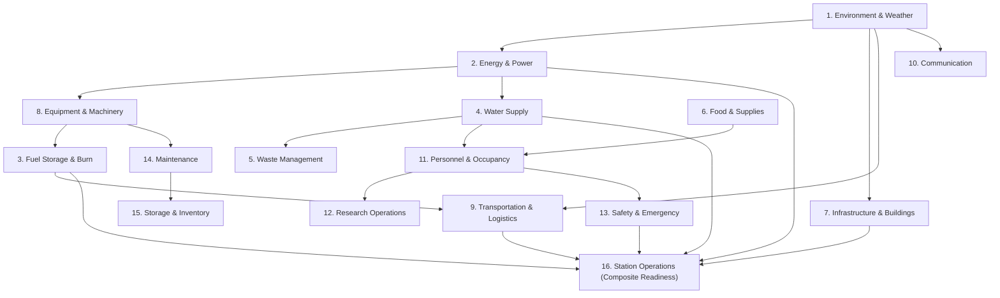

# 🧊 POLARTWIN — Antarctic Research Station Digital Twin

[](https://github.com/vals111/polartwin-demo)
[](https://github.com/vals111/polartwin-demo)
[](https://github.com/vals111/polartwin-demo)
[](https://github.com/vals111/polartwin-demo)
[](https://github.com/vals111/polartwin-demo)
[](https://github.com/vals111/polartwin-demo)

> **Smart India Hackathon 2026 | Problem Statement: SIH26060**  
> **Nodal Agency:** Ministry of Earth Sciences (MoES) / National Centre for Polar and Ocean Research (NCPOR)  
> **Application:** Real-Time Physics-Informed Digital Twin, Causal Telemetry Engine, and Decision Intelligence Platform for Polar Stations.

---

## 📋 Table of Contents

- [Overview](#-overview)
- [Key Innovations & Capabilities](#-key-innovations--capabilities)
  - [1. Inter-Domain Causal Propagation (2D & 3D)](#1-inter-domain-causal-propagation-2d--3d)
  - [2. Decision Intelligence Engine](#2-decision-intelligence-engine)
  - [3. Station-Aware Physics Simulation (Maitri vs. Bharati)](#3-station-aware-physics-simulation-maitri-vs-bharati)
  - [4. Interactive 3D Spatial Digital Twin](#4-interactive-3d-spatial-digital-twin)
  - [5. Non-Destructive What-If Simulation Sandbox](#5-non-destructive-what-if-simulation-sandbox)
- [The 16 Interconnected Operational Domains](#-the-16-interconnected-operational-domains)
- [System Architecture](#️-system-architecture)
- [Project Directory Structure](#-project-directory-structure)
- [Quick Start Guide](#-quick-start-guide)
  - [Prerequisites](#prerequisites)
  - [Backend Setup](#1-backend-setup)
  - [Frontend Setup](#2-frontend-setup)
- [Pre-Seeded Personas & Credentials](#-pre-seeded-personas--credentials)
- [Testing & Quality Assurance](#-testing--quality-assurance)
- [WebSocket & API Reference](#-websocket--api-reference)
- [Contributing & License](#-contributing--license)

---

## 🌐 Overview

Operating scientific research stations in Antarctica represents humanity's most demanding remote operational challenge. With ambient winter temperatures dropping below **-60°C**, katabatic wind blasts exceeding **150 km/h**, and complete maritime isolation for up to 9 months, a single cascade failure (e.g., fuel freeze-up &rarr; generator shutdown &rarr; life-support loss) threatens expedition survival.

**POLARTWIN** is a real-time, physics-informed Digital Twin engineered specifically for India's Antarctic stations:
- **Maitri** (inland, freshwater lake ecosystem in Schirmacher Oasis)
- **Bharati** (coastal, automated CHP units and seawater RO desalination in Larsemann Hills)

Rather than treating station telemetry as disjointed time-series charts, POLARTWIN implements a **deterministic causal graph** connecting **16 interdependent operational domains**. An environmental drop in temperature or blizzard-induced whiteout triggers deterministic physics calculations across energy demand, generator fuel consumption, heat trace circuits, water intake, logistics scheduling, and composite survival risk.

---

## 🌟 Key Innovations & Capabilities

### 1. Inter-Domain Causal Propagation (2D & 3D)

Station resilience depends on understanding how a disruption in one system ripples through others. POLARTWIN provides dual interactive causal views:

- **2D Hierarchical Causal Tree**:
  - **Spacious, Unboxed Architecture**: Clean, high-visibility operational instrument cards featuring live dials, sparkline mini-meters, and dynamic telemetry values.
  - **Intuitive Dual Interaction**:
    - **Card Click**: Directly navigates to the target domain's full operational cockpit.
    - **Arrow / Impact Button**: Triggers the **Causal Propagation Modal**, visualizing upstream dependencies, downstream impact coefficients, and multi-hop consequence pathways.
  - **Strict Priority Tiers**: Structured along the primary physical transmission vector: `Environment → Energy → Generator → Fuel → Logistics → Safety`.

- **3D Continuous Orbital Graph**:
  - **Three.js / React Three Fiber** dynamic orbital space with 9 vibrant, station-calibrated domain globes.
  - **Continuous Orbital Rotation**: Smooth, cinematic rotation that continues seamlessly without jarring hover-pause interruptions.
  - **Interactive 3D Cards**: Enlarged, legible floating status cards with direct navigation and impact modal triggers.

### 2. Decision Intelligence Engine

Each operational domain is equipped with an integrated **Decision Intelligence Suite** accessible from the main cockpit:
- **Predictive Forecasting**: Hybrid ensemble combining **Random Forest** and **Holt-Winters Exponential Smoothing** with 90% confidence bands predicting resource exhaustion up to 14 days in advance.
- **Anomaly Detection**: 3-layer validation combining hard physical threshold tripwires, rolling statistical Z-scores (`|z| > 3.0`), and unsupervised `IsolationForest(contamination=0.05)`.
- **Reinforcement Learning (RL) Optimization**: Continuous optimization of generator load sharing, battery storage reserves, and heating schedule management.
- **Root-Cause Explainability**: Plain-language, transparent AI explanations breaking down contributing factors for every alert and risk score increment.
- **Actionable AI Mitigations**: Context-aware emergency checklists, automated dispatch recommendations, and containment steps.

### 3. Station-Aware Physics Simulation (Maitri vs. Bharati)

POLARTWIN avoids one-size-fits-all assumptions by modeling the distinct mechanical and environmental characteristics of both Indian research bases:

| Attribute | **Maitri** (Inland Station) | **Bharati** (Coastal Station) |
|---|---|---|
| **Location** | Schirmacher Oasis (~100 km inland from shelf) | Larsemann Hills (coastal promontory) |
| **Water Supply** | Lake-water pump house from **Priyadarshini (Zub) Lake** | **Quilty Bay seawater intake** with trace-heated lines & RO desalination |
| **Power Generation** | Conventional diesel generators with manual load shifting | 3 &times; 100 kVA automated Combined Heat & Power (CHP) units |
| **Logistics Vector** | Overland PistenBully sled traverses across sea-ice and shelf | Direct ice-class vessel berthing (R/V *Maitri* / chartered icebreaker) |
| **Waste Treatment** | High-temperature incinerator toilets & solid waste backhaul | Integrated biological wastewater treatment + Treaty-compliant greywater processing |
| **Thermal Profile** | Extreme continental chill, heavy drifting sastrugi | Strong coastal katabatic storms, marine salt spray, rapid freeze-thaw cycles |

### 4. Interactive 3D Spatial Digital Twin

- Built with **Three.js**, **React Three Fiber**, and **Drei**.
- Full 3D visual models of station buildings and infrastructure modules:
  - **Main Habitat Complex** (thermal zoning, personnel occupancy, air exchange).
  - **Generator Units & CHP Shed** (active combustion, vibration levels, run hours).
  - **Fuel Tank Farm** (tank fill levels, heating trace status, freeze margin).
  - **Water Intake Pump Station** (flow rate, pipe thermal gradients).
  - **Satcom Dome & Antenna Array** (radome de-icing, elevation angle, link budget).
- Dynamic weather overlays including blizzard particle storms, polar day/night lighting cycles, and thermal infrared camera inspection modes.

### 5. Non-Destructive What-If Simulation Sandbox

Operators can clone the current live station state into an isolated sandbox to test extreme scenarios without impacting active operations:
- **Pre-configured Crisis Scenarios**:
  - *Severe 3-Day Blizzard (140 km/h winds, -55°C)*
  - *Catastrophic CHP Generator #1 Failure*
  - *Priyadarshini Water Intake Trace-Heating Circuit Fault*
  - *Delayed Annual Resupply Vessel (45-day ice blockage)*
  - *Sudden Fuel Contamination / Micro-leakage*
- **Comparative Side-by-Side Impact Matrix**: Instant diff of baseline telemetry vs. perturbed trajectory showing exact days-to-failure margins and recommended preventative counter-measures.

---

## ⚙️ The 16 Interconnected Operational Domains

POLARTWIN models 16 synchronized operational subsystems:



1. **Environment & Weather**: Ambient air temperature, katabatic wind velocity, barometric pressure, blizzard severity index, and solar irradiance.
2. **Energy & Power**: Base electrical demand, active heating loads, solar PV array generation, generator dispatch, and battery bank buffers.
3. **Fuel Storage & Burn**: Multi-tank inventory, burn rates, Arctic diesel gel-point temperature margins, and survival days margin.
4. **Water Supply & Thermal Integrity**: Priyadarshini Lake vs. Quilty Bay intake, pipe freeze risk, electrical heat-tracing, and storage cistern levels.
5. **Waste Management**: High-temperature incinerator performance, biological wastewater treatment, and Madrid Protocol environmental compliance.
6. **Food & Supplies**: Ration inventory, freezer cold-chain temperatures (-20°C monitoring), and emergency iron ration reserves.
7. **Infrastructure & Buildings**: Habitat envelope thermal resistance (R-value), structural wind stress load, and seal integrity.
8. **Equipment & Machinery**: Cumulative run hours, tri-axial vibration, load-stress degradation curves, and failure probability scores.
9. **Transportation & Logistics**: Annual shipping window schedules, sea-ice thickness, PistenBully traverse fleets, and weather delay penalties.
10. **Communication**: LEO Polar satellite links, Inmarsat broadband backup, radome de-icer status, and packet latency.
11. **Personnel & Occupancy**: Wintering vs. summer expedition headcount, life-support resource consumption, and team duty assignments.
12. **Research Operations**: Active scientific experiments (auroral imaging, ice core analysis, seismology), laboratory load draw, and data collection rates.
13. **Safety & Emergency**: Fire suppression pressure, airlock freeze-out hazard alerts, and blizzard lockdown readiness protocols.
14. **Maintenance**: Condition-based automated work orders, maintenance history, spare verification, and post-repair health resets.
15. **Storage, Spares & Parts**: Critical spare parts catalog, Arctic-grade lubricant inventory, filters, valves, and automatic reorder warnings.
16. **Station Operations**: Executive composite health score (0–100%) aggregating all 15 operational subsystems into an MoES readiness index.

---

## 🏗️ System Architecture

```
┌─────────────────────────────────────────────────────────────────────────┐
│              FRONTEND PRESENTATION LAYER (React 18 + Vite)              │
│                                                                         │
│  [ Header Navigation Bar ]                                              │
│  ├── Dashboard ── Domains ── 3D Station Twin ── Admin Console           │
│                                                                         │
│  [ Visualization Engines ]                                              │
│  ├── 2D Causal Tree (Spacious, Unboxed Telemetry Dials & Meters)        │
│  ├── 3D Causal Orbit (Continuous Three.js / R3F Rotation)               │
│  ├── 3D Spatial Digital Twin (Station Infrastructure Model)             │
│  └── Decision Intelligence Cockpit (Forecasting, Anomaly, Risk, RL)     │
└────────────────────────────────────▲────────────────────────────────────┘
                                     │ HTTPS / Secure WebSockets
┌────────────────────────────────────▼────────────────────────────────────┐
│                  APPLICATION BACKEND LAYER (FastAPI)                    │
│                                                                         │
│  ├── WebSocket Manager: Real-time telemetry broadcasting (1s ticks)     │
│  ├── Causal Engine: 16 Deterministic Physical Propagation Modules       │
│  ├── Intelligence Service:                                              │
│  │   ├── Forecast Engine: Random Forest + Holt-Winters                  │
│  │   ├── Anomaly Detector: IsolationForest + Z-score Bounds             │
│  │   ├── Risk Quantification: Multi-domain Weighted Index Engine        │
│  │   └── What-If Sandbox: State cloning with non-destructive runs       │
│  └── REST API Routers: Station, Domains, Assets, Scenarios, Auth        │
└────────────────────────────────────▲────────────────────────────────────┘
                                     │ SQLAlchemy ORM
┌────────────────────────────────────▼────────────────────────────────────┐
│                    PERSISTENCE & TELEMETRY STORAGE                      │
│                                                                         │
│  SQLite (Zero-config local development) / PostgreSQL / Supabase         │
│  ├── Stations & Assets        ├── Equipment & Telemetry                 │
│  ├── Alerts & Risk Scores     ├── Scenarios & Simulation Runs           │
│  └── Inventory & Personnel    └── Role-Based User Accounts              │
└─────────────────────────────────────────────────────────────────────────┘
```

---

## 📁 Project Directory Structure

```
polartwin/
├── backend/
│   ├── app/
│   │   ├── api/routes/          # REST endpoints (auth, stations, domains, what-if, etc.)
│   │   ├── core/                # App config, database session, security, hashing
│   │   ├── intelligence/        # AI engines (forecasting, anomaly, risk, RL, explainability)
│   │   ├── models/              # SQLAlchemy database ORM models (15 tables)
│   │   ├── schemas/             # Pydantic validation schemas
│   │   ├── simulation/          # 16 causal domain physics simulation modules
│   │   │   ├── domains/         # Individual domain calculation engines
│   │   │   ├── engine.py        # Central tick coordinator & causal propagation loop
│   │   │   └── station_presets/ # Station-specific physical constant profiles
│   │   └── websockets/          # Real-time WebSocket connection manager & broadcasters
│   ├── tests/
│   │   ├── unit/                # Unit tests for fuel, risk, anomaly, and domain math
│   │   ├── integration/         # API, authentication, and WebSocket test suites
│   │   └── scenario/            # Multi-day blizzard and cascade failure simulations
│   ├── requirements.txt         # Python dependencies
│   └── seed_data.py             # Database seeder for stations, assets, and initial state
│
├── frontend/
│   ├── src/
│   │   ├── components/
│   │   │   ├── common/          # Navbar (with header nav), notifications, buttons
│   │   │   ├── dashboard/       # Operational cards, mini-instruments, 2D/3D causal tree
│   │   │   ├── intelligence/    # Forecast charts, risk dials, RL optimizer panels
│   │   │   ├── simulation/      # What-If scenario builder & delta comparison matrix
│   │   │   └── twin3d/          # Three.js 3D spatial station model and controls
│   │   ├── pages/               # Dashboard, Domains, StationTwin3D, Admin, Login
│   │   ├── services/            # Axios API client & WebSocket subscription hooks
│   │   ├── types/               # TypeScript interfaces for telemetry and domain models
│   │   └── index.css            # Tailwind CSS design system & custom glassmorphism styles
│   ├── package.json
│   ├── tailwind.config.js
│   └── vite.config.ts
└── README.md
```

---

## 🚀 Quick Start Guide

### Prerequisites

- **Python**: 3.10 or higher
- **Node.js**: 18.x or higher (`npm` v9+)
- **Git**: Installed and configured

---

### 1. Backend Setup

```bash
# 1. Navigate to the backend directory
cd backend

# 2. Create and activate a virtual environment
# On Windows:
python -m venv venv
.\venv\Scripts\activate
# On macOS / Linux:
python3 -m venv venv
source venv/bin/activate

# 3. Install backend dependencies
pip install -r requirements.txt

# 4. Initialize database and seed station configurations
python seed_data.py

# 5. Start the FastAPI application server
python -m uvicorn app.main:app --host 127.0.0.1 --port 8000 --reload
```

- **Interactive API Documentation (Swagger UI)**: [`http://127.0.0.1:8000/docs`](http://127.0.0.1:8000/docs)
- **Alternative ReDoc Docs**: [`http://127.0.0.1:8000/redoc`](http://127.0.0.1:8000/redoc)
- **Health Check**: [`http://127.0.0.1:8000/api/v1/health`](http://127.0.0.1:8000/api/v1/health)

---

### 2. Frontend Setup

```bash
# 1. Open a new terminal and navigate to the frontend directory
cd frontend

# 2. Install NPM packages
npm install

# 3. Launch the Vite development server
npm run dev
```

- **Application Web UI**: [`http://localhost:5173`](http://localhost:5173)
- Direct quick-login buttons are provided on the login page for rapid role-based testing.

---

## 🔑 Pre-Seeded Personas & Credentials

The system includes pre-configured role-based access accounts ready for demonstration:

| Role | Email | Password | Permissions & Access Scope |
|:---:|:---:|:---:|:---|
| **Admin** | `admin@polartwin.gov.in` | `Admin@1234` | Full access: User administration, system settings, manual tick triggers, scenario management. |
| **Operator** | `operator@polartwin.gov.in` | `Operator@1234` | Operational control: Live telemetry monitoring, What-If simulation execution, mitigation deployment. |
| **Viewer** | `viewer@polartwin.gov.in` | `Viewer@1234` | Read-only inspection: Telemetry dashboards, 3D Spatial Twin exploration, predictive analytics. |

*(For convenience during evaluation, clicking any role pill on the Login screen auto-fills these credentials).*

---

## 🧪 Testing & Quality Assurance

POLARTWIN maintains a 100% passing test suite across unit, integration, and scenario tiers:

```bash
cd backend
python -m pytest -v
```

### Verified Test Coverage (56 Passed):
- `tests/unit/test_fuel_simulation.py`: Validates Arctic diesel burn rates, temperature-dependent viscosity derating, and tank reserve thresholds.
- `tests/unit/test_risk_engine.py`: Asserts deterministic weighted scoring across all 16 domains and risk level transitions (Low &rarr; Moderate &rarr; High &rarr; Critical).
- `tests/unit/test_anomaly.py`: Confirms statistical Z-score bounds, hard limits, and IsolationForest outlier classification.
- `tests/unit/test_domains.py`: Validates environmental heat-loss calculations, generator load-splitting, and water intake thermal balances.
- `tests/integration/test_api_telemetry.py`: Tests JWT authentication, station switching, WebSocket streaming payloads, and REST endpoints.
- `tests/scenario/test_storm_scenario.py`: Executes a 72-hour simulated katabatic blizzard, verifying that risk levels escalate and recovery protocols trigger correctly without contaminating live operational state.

### Frontend Production Build Verification:
```bash
cd frontend
npm run build
# Verified: 0 TypeScript errors, production bundle built in ~1.4s
```

---

## 📡 WebSocket & API Reference

### Real-Time WebSocket Streaming
- **Endpoint**: `ws://127.0.0.1:8000/ws/station/{station_id}`
- **Payload**: Broadcasts complete 1-second synchronized station telemetry packets, active alarms, and composite risk index updates.

### Key REST Endpoints
- `POST /api/v1/auth/login`: Authenticate and receive JWT bearer token.
- `GET /api/v1/stations`: Retrieve list of Antarctic research stations and operational summaries.
- `GET /api/v1/stations/{id}/domains`: Fetch real-time status and sensor arrays for all 16 domains.
- `GET /api/v1/stations/{id}/telemetry/latest`: Latest raw sensor readings across all station assets.
- `POST /api/v1/simulation/what-if`: Submit a perturbed condition set and receive non-destructive projected trajectories.
- `GET /api/v1/intelligence/forecast/{domain}`: Return 14-day ML forecasting bounds and confidence intervals.
- `GET /api/v1/intelligence/recommendations/{station_id}`: Retrieve active AI-generated emergency mitigations.

---

## 👥 Authors & Team

Developed for the **Smart India Hackathon (SIH) 2026** under Problem Statement **SIH26060** for the **Ministry of Earth Sciences (MoES) / National Centre for Polar and Ocean Research (NCPOR)**.

---

## 📄 License

This project is licensed under the **MIT License** — see the [LICENSE](LICENSE) file for full details.
